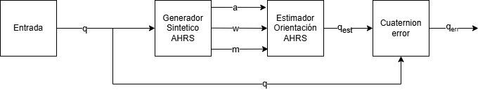
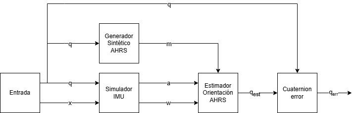
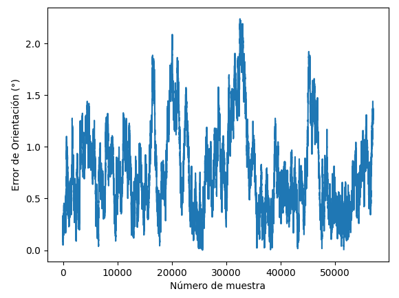
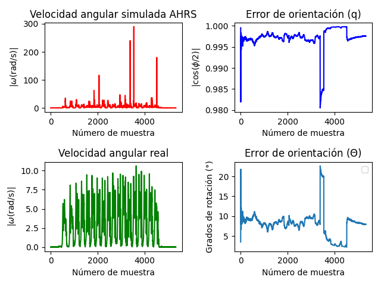
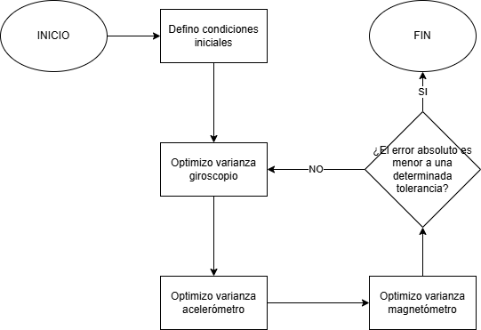
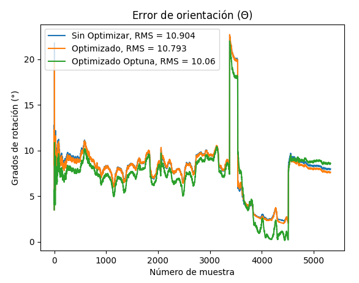

# Resumen Dual IMU Ranging

## Datasets
Para este estudio se utilizaron los siguientes datasets disponibles públicamente:
* Dataset PyShoe: https://github.com/utiasSTARS/pyshoe
* Dataset HelmetPoser: https://lqiutong.github.io/HelmetPoser.github.io/

## Algoritmos de Orientación
Para este estudio se consideraron los siguientes algoritmos:

* Filtro de Kalman Extendido (EKF)
* Filtro de Mahony
* Filtro de Madgwick
* Filtro Complementario

Se utilizaron las implementaciones de la librería AHRS (Attitude Heading Reference System) en Python. Descripciones detalladas de los algoritmos pueden encontrarse en la documentación correspondiente: https://ahrs.readthedocs.io/en/latest/index.html. En todos los diagramas y resultados presentados en este resumen se utiliza el EKF como algoritmo de estimación de orientación.

## Simulación de unidad de medida inercial

En este estudio se trabajó con dos simuladores de IMU:

1. La librería AHRS presenta una implementación propia de un simulador de IMU cuya descripción se encuentra detallada en la documentación correspondiente (https://ahrs.readthedocs.io/en/latest/sensors.html).
2. Se utilizó el simulador de IMU proveniente del siguiente repositorio https://github.com/xioTechnologies/IMU-Simulator.

Para poder validar la fiabilidad de las simulaciones de IMU provenientes de la librería AHRS se propuso el sistema presentado en la siguiente figura.

   
  <strong>Figura 1:</strong> Esquema de validación del simulador de IMU con la librería AHRS

Para poder validar la fiabilidad de las simulaciones de IMU provenientes del repositorio de código antes mencionado (punto 2), se propuso el sistema presentado en la Figura 1. Se usó el simulador de IMU de AHRS para poder generar mediciones artificales del magnetómetro que fueran consistentes con los datos restantes.

   
  <strong>Figura 2:</strong> Esquema de validación del simulador de IMU del repositorio de GitHub

Suponiendo que se tienen $q_{real}$ y $q_{est}$ como los cuaterniones de orientación real y estimado, el error se obtiene a partir del cálculo del cuaternión que representa la rotación de uno hacia otro:

$$q_{err} = q_{real} \otimes q_{est}^{*}$$

Utilizando la convención de $q =[q_{w} \ q_{x} \ q_{y} \ q_{z}]^{T}$ para el caso ideal se tiene que $q_{err}=[1 \ 0 \ 0 \ 0]^{T}$. Entonces una medida útil acerca del error es el ángulo de rotación asociado a $q_{err}$. Por la teoría se sabe que $\cos{\left( \frac{\theta}{2}\right) }=q_w$ de modo que el ángulo de error se puede calcular del siguiente modo:

$$\theta_{err} = 2\arccos(q_{w_{err}})$$

Idealmente $\theta_{err}=0$ aunque en esta aplicación se considera aceptable una tolerancia $\theta_{err}<\theta_{max}$ donde $\theta_{max}\approx5$°. Se implementó el esquema de validación de la Figura 1 y obtuvo el cuaternión de error comparando los valores real y estimado al imponer como condición inicial $q=q_{0}$ siendo $q_{0}$ el cuaternión de orientación real en $t=0$. Se observa en este escenario que $\theta_{err}<2.5$° $\forall t$ lo cual está dentro de los límites aceptables.

   
  <strong>Figura 3:</strong> Gráfico del error de orientación en función del tiempo para un registro del dataset de HelmetPoser. No se realiza optimización de varianzas para este caso

De la teoría se sabe que el cuaternión de orientación se encuentra relacionado con la velocidad angular mediante:

$$\dot q = \frac{1}{2}q \otimes \omega$$

En la ecuación anterior, $\omega$ hace referencia a la velocidad angular del sistema solidario al IMU con respecto al sistema inercial, expresado en el sistema del IMU. El simulador de IMU de AHRS utiliza una discretización de dicha ecuación para poder simular la velocidad angular en base a los cuaterniones de orientación provistos. En la Figura 4 se compara la velocidad angular simulada con la real. Se observa que la velocidad angular simulada presenta excursiones anormalmente altas en aquellos instantes en los cuales se produce un cambio brusco en la orientación.

   
  <strong>Figura 4:</strong> En la parte izquierda se tiene velocidad angular simulada artificialmente por la implementación de la librería AHRS y la real. En la parte derecha se tienen gráficos de error de cuaternión en función del tiempo.

## Optimización de varianzas de Ruido

Se buscó una manera de estimar las varianzas correspondientes a los ruidos del giroscopio, acelerómetro y magnetómetro, denotadas como $\sigma_{a}^{2}$, $\sigma_{g}^{2}$, $\sigma_{m}^{2}$ respectivamente. Esta optimización tiene sentido para el algoritmo EKF (los otros algoritmos optimizan parámetros diferentes). A estos efectos se implementaron y compararon los siguientes algoritmos de optimización:

1. <em>Random Search</em>: Se utilizaron las funciones previamente implementadas de la librería Optuna (https://optuna.org/) en Python.
2. <em>Grid Search</em>: Se diseñó un algoritmo personalizado, presentado en la Figura 5.

Dado que el problema de optimización es no convexo en este caso, el propósito consistió en hallar combinaciones de parámetros en los cuales se produzca un mínimo local y no uno global.

   
  <strong>Figura 5:</strong> Esquema del algoritmo de optimización de varianzas utilizando una variante de <em>grid search</em>

Con el fin de comparar el desempeño de ambos algoritmos, se tomó un registro particular y se llevó a cabo la optimización. Si bien el gráfico de evolución en el tiempo permite observar los efectos de la optimización, pareció conveniente utilizar el valor cuadrático medio del error de orientación como métrica objetiva del error. La expresión matemática se encuentra dada por:

$$RMS = \sqrt{\sum_{n=1}^{N} 2\arccos(|q_{w_{err_{n}}}|)^2}$$

   
  <strong>Figura 6:</strong> Gráfica evolutiva en el tiempo comparando el error de orientación antes y despues de optimizar usando los algoritmos mencionados, para un conjunto de datos particular

## Análisis Futuro

La idea es que los algoritmos de estimación de orientación de una IMU a partir de las mediciones del acelerómetro y giroscopio (además de valores de magnetómetro eventualmente) puedan ser utilizados en el estudio de la orientación relativa entre dos nodos ubicados en puntos diferentes.

Dado que en esta aplicación lo que interesa determinar son la posición, velocidad y orientación relativas entre dos nodos (denomínense $i$ y $j$) mediante el uso de mediciones de ranging, pueden haber dos acercamientos:

1. El primer acercamiento implicaría unificar los algoritmos de estimación de orientación con las ecuaciones de sistema de navegación inercial (INS) construyendo un único EKF con un vector de estados dado por: 

$$x=[q_{ij}\ v_{ij}\ p_{ij}] \in \mathbb{R}^{10}$$

cuyos elementos representan la orientación, velocidad y posición relativas respectivamente.
2. El segundo acercamiento implica obtener la orientación relativa entre ambos nodos externamente mediante la ecuación: 

$$q_{ij} = q_{i} \otimes q_{j}^{*}$$

donde $q_{i}$ y $q_{j}$ representan las orientaciones absolutas de los nodos $i$ y $j$ obtenidas mediante algoritmos de estimación de orientación (EKF, Mahony, Madgwick, etc). Luego estos valores pueden ser utilizados como parte de la entrada de un EKF cuyo estado se reduciría a

$$x=[v_{ij}\ p_{ij}]\in \mathbb{R}^{6}$$

El hecho de plantear las variables de estado en términos de cantidades relativas hace que sea más complicado aplicar directamente la corrección de velocidad nula en cada pie en período de <em>stance</em>. Entonces en principio se cuenta únicamente con la medición del ranging de ultrasonido y por lo tanto en este caso la ecuación de medición puede escribirse como:

$$z_{k}=h(x_{k})+v_{k}= \lVert p_{ij_{k}} \rVert +v_{k}$$

donde $v_{k}$ representa el ruido de proceso y en principio se modela como AWGN.